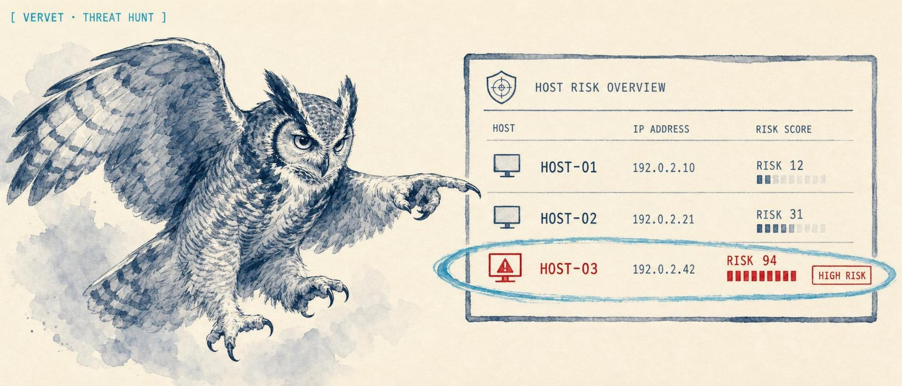
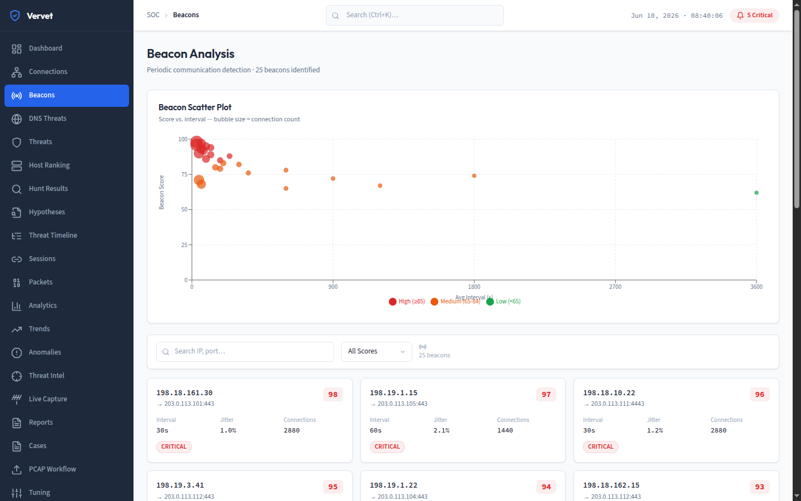
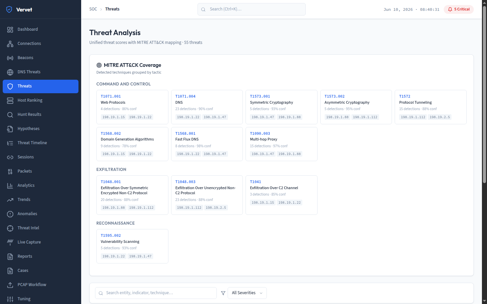
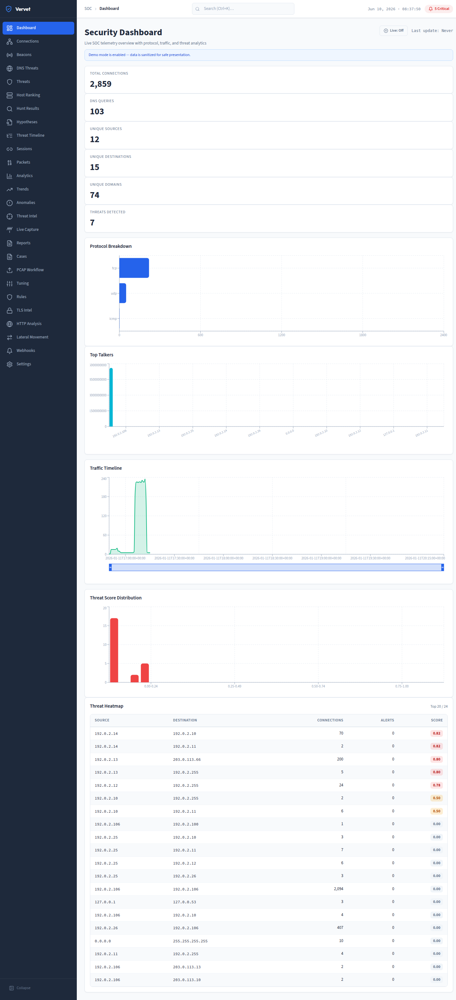

<p align="center">
  
</p>

<h1 align="center">Vervet</h1>

<p align="center">
  <strong>Vervet reads your Zeek and Suricata logs and tells you which hosts are compromised and why.</strong>
</p>

<p align="center">
  <a href="https://github.com/solomonneas/vervet/actions/workflows/ci.yml"></a>
  
  
  
  <a href="LICENSE"></a>
  <a href="https://solomonneas.dev/projects/vervet"></a>
</p>

Point Vervet at a directory of Zeek and Suricata logs and it surfaces the threats hiding in them: C2 beacons phoning home on a fixed interval, DNS tunneling and DGA domains, data exfiltration, lateral movement, and long-lived connections that shouldn't exist. Every flagged host gets a transparent risk score with the **evidence chain that produced it** and the **MITRE ATT&CK techniques** it maps to, so an analyst sees not just *what* fired but *why*. It runs as a single container on your own hardware. No cloud, no telemetry, no live tap required, and it never touches your network, it only reads logs you already collect.

Vervet is for blue teams, SOC analysts, and MSSPs who run Zeek or Suricata and want the analyst layer that hunts the logs for them, the way RITA and AC-Hunter do for beaconing, but UI-first, MITRE-mapped, and speaking both sensors.

<p align="center">
  
</p>

<p align="center">
  
  
</p>

<p align="center"><sub>Demo data: real Zeek logs (sanitized) with a synthetic C2 beacon and DNS-tunnel scenario layered in. Every address is an RFC 5737 / RFC 2544 documentation range.</sub></p>

## Try it with zero logs of your own

Demo mode loads a realistic sample environment (beaconing C2, DNS tunneling, a noisy Suricata sensor) so the dashboard shows scored, explained threats immediately:

```bash
git clone https://github.com/solomonneas/vervet.git
cd vervet
docker compose up -d --build
# open http://localhost:8000
```

The container serves the API and the web UI on the same port and seeds the demo data on startup. Stop it with `docker compose down`.

## Run it on your own logs

```bash
# Point it at your Zeek/Suricata log directory instead of the demo data
docker compose run --rm -e VERVET_DEMO_MODE=false \
  -v /var/log/zeek:/logs:ro vervet
```

Then upload or ingest logs from the UI, or via the REST API:

```bash
# Zeek conn/dns/http/ssl logs and Suricata eve.json are all accepted
curl -X POST http://localhost:8000/api/v1/ingest/directory \
  -H "X-API-Key: $VERVET_API_KEY" \
  -H "Content-Type: application/json" \
  -d '{"path": "/logs"}'
```

### Without Docker (development)

```bash
# Backend (FastAPI) on :8000
pip install -r requirements.txt
VERVET_DEMO_MODE=true uvicorn api.main:app --host 0.0.0.0 --port 8000

# Frontend (Vite dev server) on :5174, in another terminal
npm install && npm run dev
```

`make dev` starts both at once. See the [Makefile](Makefile) for individual targets.

## What it detects

| Detection | What it finds | Maps to |
| --- | --- | --- |
| **Beaconing / C2** | Periodic callbacks by interval regularity, jitter, and data-size consistency | T1071, T1571 |
| **DNS tunneling** | High-entropy subdomains and oversized TXT/NULL records used as a covert channel | T1071.004, T1048 |
| **DGA domains** | Algorithmically generated domains via n-gram and lexical analysis | T1568.002 |
| **Fast-flux** | Domains rotating through many IPs to hide infrastructure | T1568 |
| **Lateral movement** | Internal-to-internal connection patterns that suggest pivoting | T1021 |
| **Long connections** | Unusually persistent flows by duration, protocol, and direction | T1071, T1572 |
| **Suricata alerts** | Severity-weighted IDS alerts folded into the same per-host score | varies |

Each detection contributes to a **unified per-host risk score (0-100)** with a full reasoning chain. Scoring is deterministic and explainable, not a black box: you can read exactly which signals raised a host's score and by how much.

## How it works

```
Zeek logs (conn/dns/http/ssl/x509/notice)   Suricata eve.json
                 \                                  /
                  +--> unified parsers -------------+
                                |
                  detection engines (beacon, DNS threat,
                  lateral movement, long-conn, Suricata)
                                |
                  unified threat engine -> per-host score
                  + MITRE ATT&CK mapping + evidence chain
                                |
         web UI + REST API  <---+---> case management / IOC export
                                       (TheHive / Wazuh / MISP)
```

Logs are parsed into a common connection/event model, run through each detection engine, and aggregated by the unified threat engine into per-host scores with MITRE mappings and evidence chains. Findings can be promoted to cases, exported as IOCs, and pushed to TheHive, correlated against Wazuh, or enriched from MISP.

> **Note on persistence (current limitation):** the OSS edition keeps its analysis index **in memory**. It is built for log-batch hunting and triage sessions, not yet as a long-running system of record. Restarting clears loaded logs and analysis (cases, hunt notes, and trends are file-backed). A durable store is the top roadmap item, see below.

## Integrations

Initial endpoints exist for exporting cases to **TheHive**, correlating IOCs against **Wazuh** alerts, and enriching IOCs from **MISP**. Configure via environment variables (`THEHIVE_URL`/`THEHIVE_API_KEY`, `WAZUH_URL`/`WAZUH_API_KEY`, `MISP_URL`/`MISP_API_KEY`) and drive from `/api/v1/integrations/*`.

## Security model

- **Read-only on the wire.** Vervet ingests logs you already collect. There is no code path that talks to a network device or captures live traffic.
- **API-key auth.** Set `VERVET_API_KEY` to require a key on every request. Without it, the server runs in open dev mode and says so loudly at startup.
- **Ingestion sandbox.** Set `VERVET_LOG_ROOT` to restrict directory ingestion to a single tree, so the API can't be coaxed into reading arbitrary paths.
- **Upload rate limiting.** PCAP/upload endpoints are rate-limited by default (`VERVET_RATE_LIMIT_*`) to protect public deployments.
- **Local data, no telemetry.** Everything stays in your data directory. No external calls except the integrations you configure.

## Roadmap

- **Durable persistence** (SQLite-backed index, audit trail) so investigations survive restarts, the prerequisite for team use.
- **Live log tailing** for near-real-time dashboards instead of batch ingest.
- **Multi-sensor** support and alert suppression / noise controls.
- **MCP server** so agents can query hunts directly.

## License

Apache-2.0. See [LICENSE](LICENSE).
